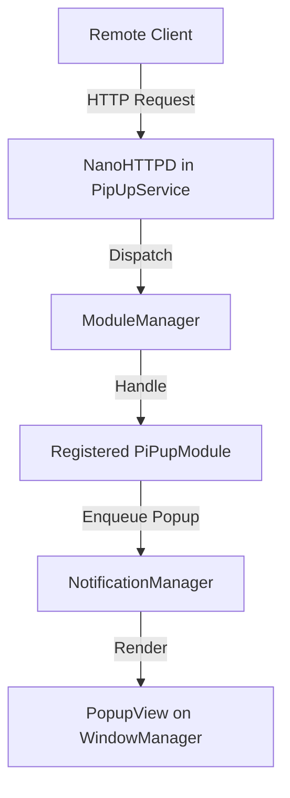

# PiPup Architecture Overview

PiPup follows a strict modular "Docking" architecture. The core system is designed to be "blind" to specific module implementations, providing only the necessary infrastructure for modules to register their functionality.

## Core Components

### 1. PipUpService

The main background service (`PipUpService.kt`) hosts the NanoHTTPD web server and manages the `NotificationManager`. It acts as the primary entry point for all remote requests but delegates processing to the `ModuleManager`.

### 2. ModuleManager

The `ModuleManager.kt` is the brain of the modular system. It:

- Maintains a registry of all available `PiPupModule` instances.
- Manages module lifecycles (ON, OFF, ECO).
- Dispatches HTTP requests to the appropriate module based on `supportedRoutes`.
- Augments the global `/state` response with module-specific data.

### 3. NotificationManager

Responsible for the display queue and view lifecycle of overlays. It ensures that only one popup is shown at a time and performs aggressive cleanup of views and resources (like WebViews) to maintain a low RAM footprint.

## Data Flow

## UI Registry & Docking

In the `SettingsActivity.kt`, a centralized `moduleSubmenuFactories` registry is used to map layout resources to specialized UI controllers.

- Modules can provide a custom `layoutRes` in their `ModuleMenuDefinition`.
- The Activity creates the corresponding controller (e.g., `VendorSubmenu`) without knowing about the module's identity.
- If no custom layout is provided, the generic `ModuleSubmenu` is used.

## Design Principles

- **The Core is Blind:** No `if (moduleId == "...")` checks are allowed in the core or UI classes.
- **Resource Efficiency:** Modules in `ECO` mode are unloaded when idle to save RAM on Android TV devices.
- **Centralized Permissions:** All strings and ADB commands for permissions live in `Permissions.kt`, but visibility is driven by module requirements.
